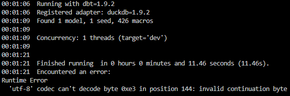

# Desafio DIT Data Science

## Sobre o projeto

Durante o desenvolvimento do projeto, logo no início ocorreram problemas com a importação dos dados pelo DBT. O arquivo CSV disponibilizado, `dados_ficha_a_desafio.csv`, aparentemente causa algum tipo de conflito de encoding com o parser do DBT, tal que quando o comando `dbt seed` é utilizado, o seguinte erro é lançado:



Tentar corrigir o encoding, e mudar para outros como Latin-1 ou Windows-1252 simplemsente agravaram a corrupção do arquivo. Ademais, mesmo após extensa manipulação dos dados, o erro persistiu. Assim, para atender ao desafio dentro destas limitações, discuti a exploração, correção e decisões de arquitetura relacionadas ao dataset em um Jupyter Notebook, por julgar ser mais fácil de discorrer sobre os motivos das decisões tomadas.

Neste, exploro os dados e apresento questões de modelagem inerentes ao dataset, e crio duas versões com diferentes arquiteturas — _data warehouse_ e _data lake_, cada qual com sua finalidade — para disponibilizá-lo, aplicando o que seriam "correções" no contexto de cada arquitetura.

Além disso, para conseguir concretizar as soluções, gero arquivos CSV para as tabelas de cada arquitetura, e ao final apresento _mockups_ de modelos DBT baseados em Python [de acordo com a documentação do DBT](https://docs.getdbt.com/docs/build/python-models), que poderiam ser usados com o CSV original para materializar estas mesmas tabelas em um SGBD.

## Estrutura de pastas

Abaixo, apresento a estrutura de pastas do projeto.

```
├───analise_desafio
│   ├───codigo
│   │   ├───jupyter
│   │   └───python
│   └───dados
│       ├───data_lake     
│       ├───data_warehouse
│       └───fonte
├───db_desafio
│   ├───analyses
│   ├───logs
│   ├───macros
│   ├───models
│   │   └───dados_desafio 
│   ├───seeds
│   ├───snapshots
│   ├───target
│   └───tests
└───logs
```
- Em `analise_desafio`, estão os arquivos utilizados para fazer a exploração dos dados.
    -  Em `codigo`, temos o Jupyter Notebook na pasta `jupyter` e os arquivos de constantes e funções utilitárias em `python`;
    - Em `dados`, temos:
        - `fonte`, onde está o arquivo original;
        - `data_lake`, onde está o arquivo CSV com os dados estruturados para um _data lake_;
        - `data_warehouse`, onde estão diversos arquivos CSV para as tabelas dimensão, ponte e fato, cada com seus dados estruturados para um _data warehouse_;
- Em `db_desafio`, estão os arquivos utilizados na tentativa de criação de uma estrutura de banco de dados com DBT. Ela segue a estrutura usual de um projeto DBT.